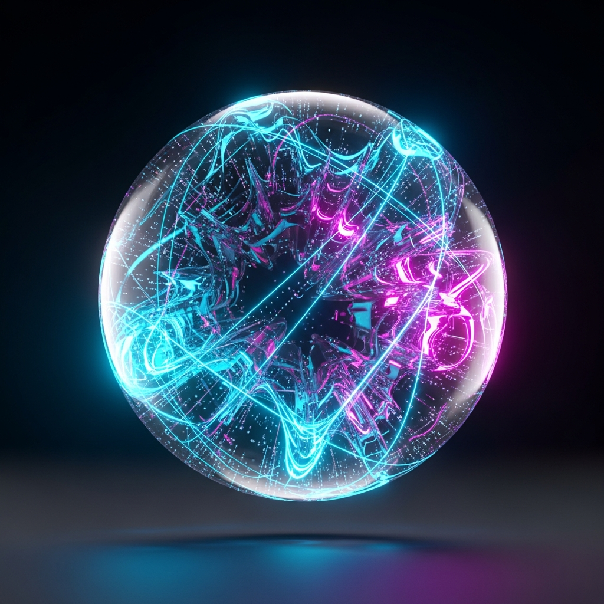

<div align="center">
    
</div>

<h1 align="center">
⚛️ Nebula AI
</h1>

An AI-chatbot app written in React Native (Expo), Nativewind (native Tailwind CSS), and React Native Reanimated that I'm building in public on YouTube [here](https://www.youtube.com/playlist?list=PL9LMfcQwJu49dfQjGwatQv_X_sY2fiWPd).

## 🤖 ➞ 🤖 Cloning the Project

### via SSH Protocol (Recommended)

Somewhere in your machine's system (e.g., in a folder for all your coding project), run:

```bash
git clone git@github.com:pjnalls/nebula-ai.git
```

### via HTTP Protocol

Somewhere in your file system (in a folder for all your coding projects is recommended), run:

```bash
git clone https://github.com/pjnalls/nebula-ai.git
```

## 💽 Installing Project Dependencies

Once you have the GitHub project on your machine, in the root of the project, run:

```bash
npm install
```

## 🏃‍♀️‍➡️ Running the Project

### Starting the Project

From the root of the project, run:

```bash
npm start
```

### Run Project on a Device

While the project is running, follow the instructions in the terminal like the following:

- Scan the QR code with your phone and follow the instructions for getting the app on a physical device.
- Press `i` to run the project in iOS Simulator.
- Press `a` to run the project on an Android emulator.
- Press `w` to run the project in the browser.

## ⚠️ Gotchas

### App doesn't start on iOS Simulator.

Sometimes you may need to reset iOS Simulator, run `npm start`, then press `i` to run the project on iOS Simulator.
